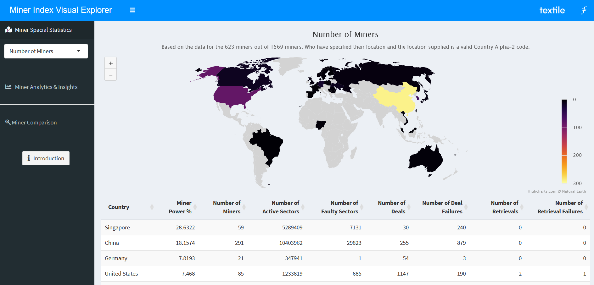

# Miner Index Visual Explorer

Gitcoin Grants Round 9 Textile Filecoin Hackathon

## Description

As part of the Gitcoin Round 9 textile Hackathon our team took on the task of creating a Miner Index Visual Explorer.  Using data from the new Filecoin Miner Index API, we've developed a collection of visualizations to help network enthusiasts get a high level overview of the health and performance of storage miners. The default page contains a global breakdown of miner activity and decentralization as measured by the percentage of miner power and the number of miners. Here performance is measured through the number of faulty sectors and retrieval failures.  In the Miner Analytics & Insights section we compute distributions to highlight group performance and expose outlying values that may be of interest. Lastly, in the Miner Comparison tab, we allow the users to compare and contrast individual miners directly.  We hope this application is not only insightful, but helps guide the community's data driven decision making and transparency efforts. 

Check out the video [here](https://youtu.be/1f1flGGqss0).

Play with the app [here](https://crypto.omnianalytics.io/apps/git-9-textile-hack/).

## About Us

[Omni Analytics Group](https://omnianalytics.io) is an incorporated group of passionate technologists who help others use data science to change the world. Our  practice of data science leads us into many exciting areas where we enthusiastically apply our machine learning, artificial intelligence and analysis skills. Our flavor for this month, the blockchain!  To learn more about what we do or just to have fun, join us over on [Twitter](https://twitter.com/OmniAnalytics).
